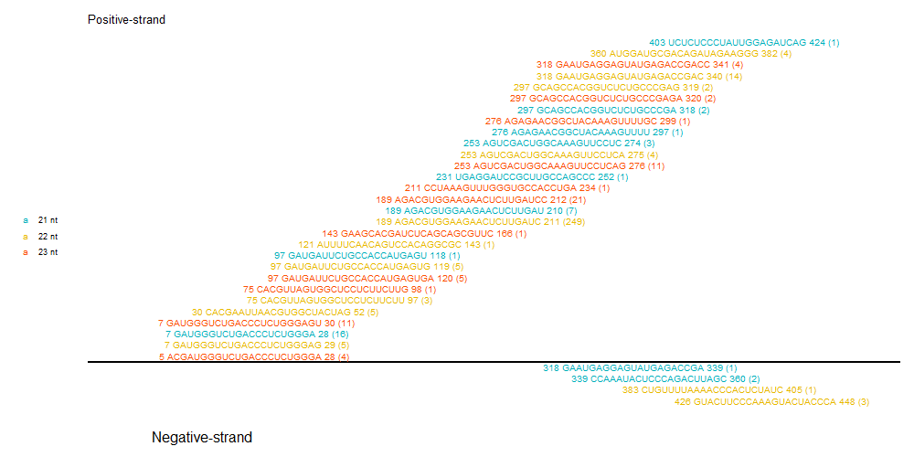
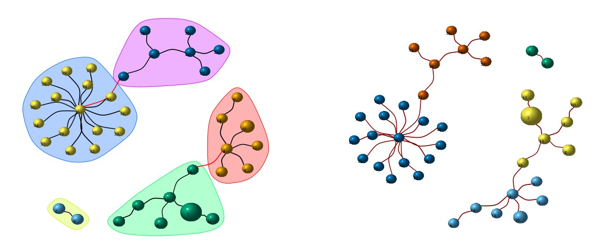
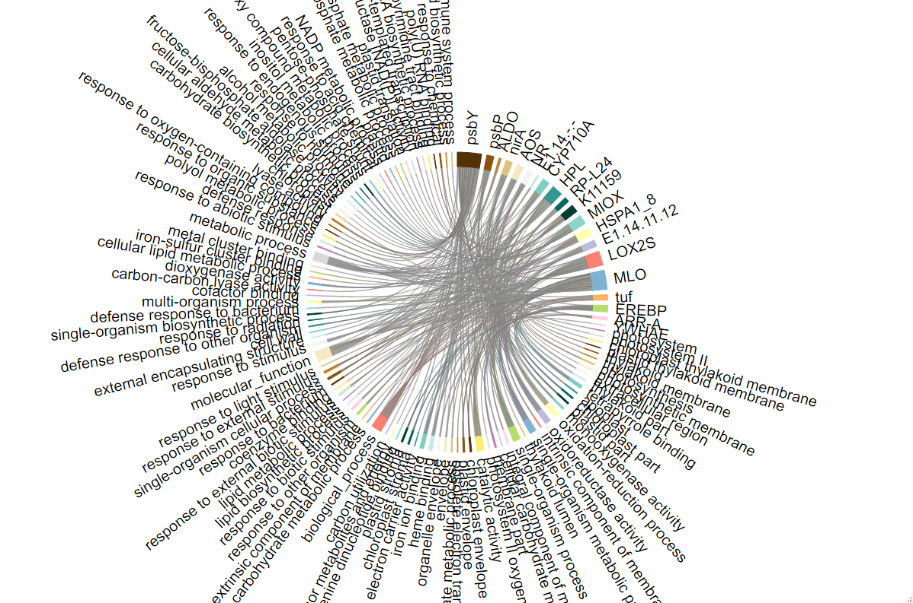
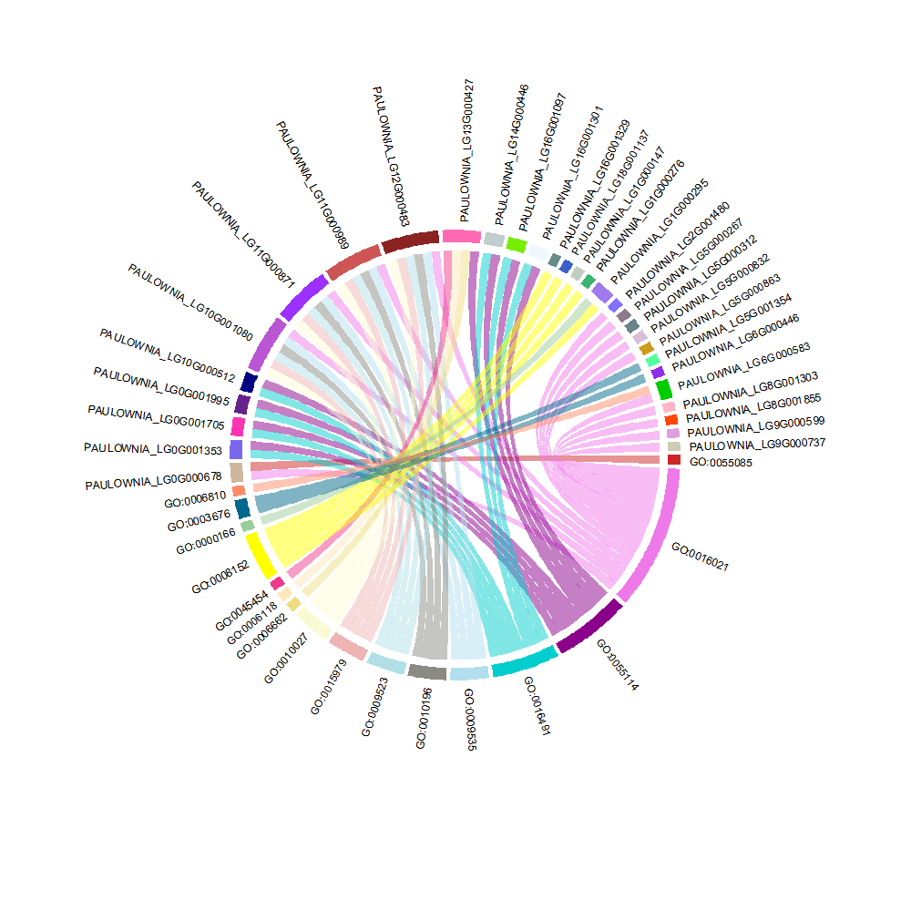
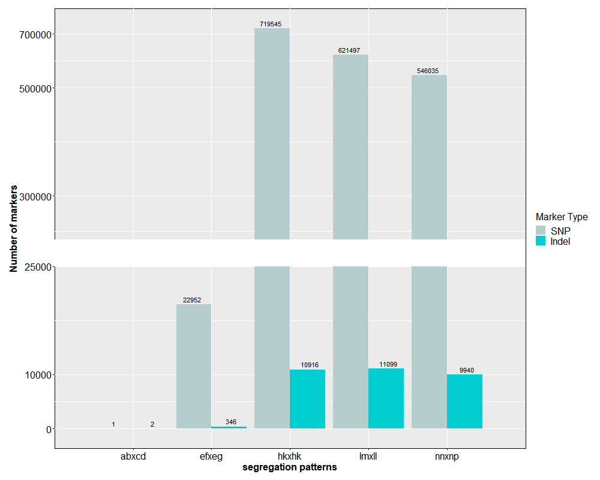
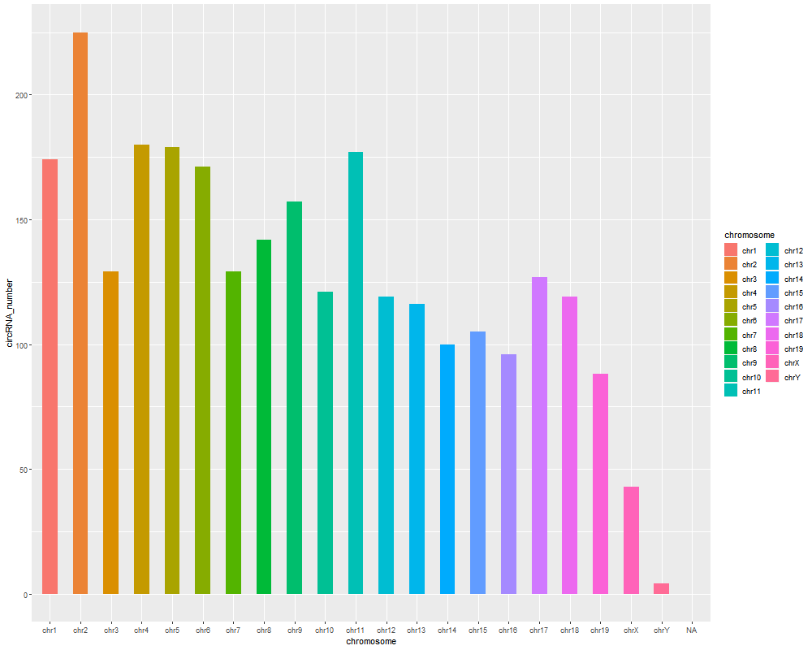

# R Script for work

### install
 
>git config --global http.sslBackend "openssl"
>git config --global http.sslCAInfo C:/Program Files/R/R-3.6.0/library/openssl/cacert.pem

### host

>reference

Schulze S, Henkel SG, Driesch D, Guthke R, Linde J. Computational prediction of molecular pathogen-host interactions based on dual transcriptome data. Front Microbiol. 2015;6:65. Published 2015 Feb 6. doi:10.3389/fmicb.2015.00065

### Read sequences along the indicated segments of the AB genome. Read counts (in brackets), read length and genomic position are indicated.

### igraph for network from expression data 

### Chord Diagram

### barplot

