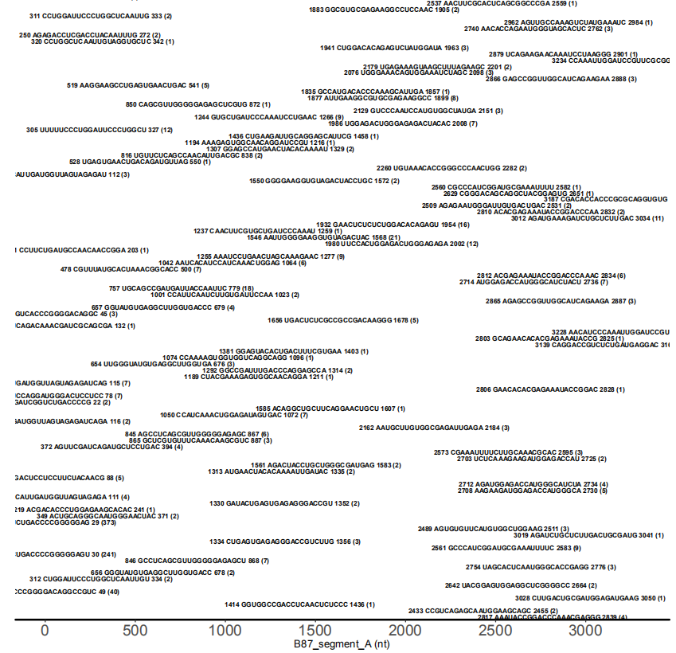

# R Script for work
### Read sequences along the indicated segments of the AB genome. Read counts (in brackets), read length and genomic position are indicated.

### igraph for network from expression data 

### Chord Diagram

### barplot

