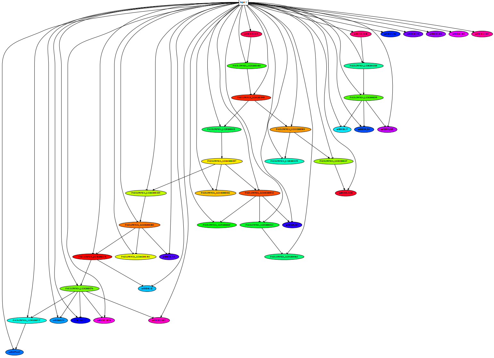

# R Script for work

### quickly install github R package 
 
 
>C:\Windows\System32\drivers\etc\hosts

>git config --global http.sslBackend "openssl"

>git config --global http.sslCAInfo C:/Program Files/R/R-3.6.0/library/openssl/cacert.pem

>git config --global http.sslCAInfo /mnt/ilustre/centos7users/dna/.env/lib/R/library/openssl/cacert.pem

### Build R Package

>git config --global user.email "czheluo@gmail.com"

>git config --global user.name "czheluo"

### Miniconda3 install R 

##### ADD CONDA-FORGE
$ conda config --add channels conda-forge 

$ conda config --set channel_priority strict

##### INSTALL 
$ conda search r-base 
$ conda create -n R4.2.2
$ conda activate R4.2.2
$ conda install -c conda-forge -r r-base=4.2.2

### host

>reference

Schulze S, Henkel SG, Driesch D, Guthke R, Linde J. Computational prediction of molecular pathogen-host interactions based on dual transcriptome data. Front Microbiol. 2015;6:65. Published 2015 Feb 6. doi:10.3389/fmicb.2015.00065

### Read sequences along the indicated segments of the AB genome. Read counts (in brackets), read length and genomic position are indicated.

### igraph for network from expression data 

### Chord Diagram

### barplot

